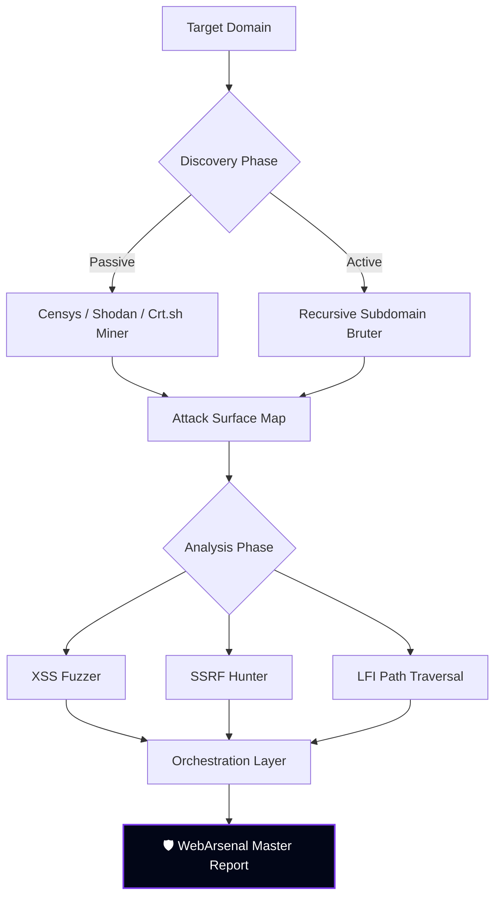
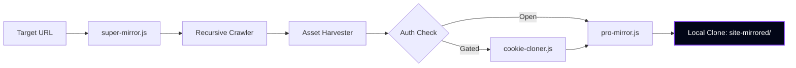

<div align="center">
 
<!-- BANNER -->


<br/>

```
██╗    ██╗███████╗██████╗      █████╗ ██████╗ ███████╗███████╗███╗   ██╗ █████╗ ██╗
██║    ██║██╔════╝██╔══██╗    ██╔══██╗██╔══██╗██╔════╝██╔════╝████╗  ██║██╔══██╗██║
██║ █╗ ██║█████╗  ██████╔╝    ███████║██████╔╝███████╗█████╗  ██╔██╗ ██║███████║██║
██║███╗██║██╔══╝  ██╔══██╗    ██╔══██║██╔══██╗╚════██║██╔══╝  ██║╚██╗██║██╔══██║██║
╚███╔███╔╝███████╗██████╔╝    ██║  ██║██║  ██║███████║███████╗██║ ╚████║██║  ██║███████╗
 ╚══╝╚══╝ ╚══════╝╚═════╝     ╚═╝  ╚═╝╚═╝  ╚═╝╚══════╝╚══════╝╚═╝  ╚═══╝╚═╝  ╚═╝╚══════╝
```

# 🛡️ De{c0}ded WebArsenal v5.5.0 `"Pulse"`

**The Ultimate High-Power Security Research & Automation Arsenal**

*Architected by [De{c0}ded by Edwin Dev](https://github.com/edwinnyandika)*

<br/>

[](https://github.com/edwinnyandika/webarsenal-v2/releases)
[](MODULES.md)
[](LICENSE)
[](https://nodejs.org)
[](https://github.com/edwinnyandika/webarsenal-v2/stargazers)
[](https://github.com/edwinnyandika/webarsenal-v2/actions)

<br/>

[⚡ Quick Start](#-quick-start) · [🗺️ Module Map](#%EF%B8%8F-module-map) · [🔥 Workflows](#-strategic-workflows) · [🛡️ Bug Hunter Mode](#%EF%B8%8F-bug-hunter-mode) · [💻 Dashboard](#-the-decd-hub) · [📖 Full Docs](MODULES.md)

<br/>

> *"The web is your database. WebArsenal is your query engine."*

</div>

---

## 🧠 What is WebArsenal?

**WebArsenal v5.5.0 "Pulse"** is an enterprise-grade, modular Node.js toolkit built for horizontal and vertical reconnaissance, recursive site mirroring, and automated vulnerability research. Consolidating over **570+ specialized security scripts**, it provides a unified orchestration layer for the modern security researcher.

Built for **developers** who need data at scale, **SEO engineers** running audits, **data engineers** building pipelines, and **security researchers** mapping attack surfaces on authorized targets.

---

## ⚡ Quick Start

```bash
git clone https://github.com/edwinnyandika/webarsenal-v2.git
cd webarsenal-v2
npm install
node core/super-mirror.js --help
```

> ⚠️ Puppeteer/Playwright download browser binaries (~300MB) on first install.

---

## 🗺️ Module Map

```
webarsenal/
├── 📁 vuln-probes/       185 modules  · Active vulnerability probing (XSS, SSRF, LFI, SQLi)
├── 📁 api-security/       92 modules  · GraphQL, REST, gRPC audits & fuzzing
├── 📁 recon/              91 modules  · DNS, subdomains, certificate transparency, OSINT
├── 📁 infrastructure/    108 modules  · Kubernetes, Docker, ElasticSearch, cloud infra
├── 📁 analyzers/         100+ modules · Security audits, DOM analysis, JS surface mapping
├── 📁 scrapers/           80+ modules · SPA scrapers, API sniffers, targeted extraction
├── 📁 cloud/              64 modules  · S3, IAM, metadata probing
├── 📁 auth-helpers/                   · Auth bypass, cookie cloning, token tools
├── 📁 exporters/                      · Format conversion (SQLite, CSV, WARC, Markdown)
├── 📁 integrations/       60 modules  · Cloud push (S3, Notion, Airtable, Slack)
├── 📁 monitors/           40 modules  · Change detection, cron jobs, webhooks
├── 📁 utils/              40 modules  · Proxy rotation, rate limiting, UA spoofing
├── 📁 reporters/                      · Report generation & master orchestration
├── 📁 core/               25 modules  · Recursive mirroring & heavy-duty downloaders
└── 📁 lib/                            · Shared runtime & module catalog
```

Full module inventory → [MODULES.md](MODULES.md)

---

## 🔒 Arsenal Inventory

| Category | Modules | Power | Purpose | Example |
| :--- | :---: | :---: | :--- | :--- |
| **Vuln Probes** | 185 | ⚡⚡⚡⚡⚡ | Active vulnerability probing | `node vuln-probes/ssrf-probe.js` |
| **API Security** | 92 | ⚡⚡⚡⚡⚡ | GraphQL, REST, gRPC audits | `node api-security/graphql-probe.js` |
| **Infrastructure** | 108 | ⚡⚡⚡⚡ | K8s, Docker, ElasticSearch | `node infrastructure/elasticsearch-checker.js` |
| **Analyzers** | 100+ | ⚡⚡⚡⚡⚡ | Security audits, XSS, SSRF | `node analyzers/xss-fuzzer.js` |
| **Recon** | 91 | ⚡⚡⚡⚡ | DNS, subdomains, OSINT | `node recon/dns-brute-forcer.js` |
| **Scrapers** | 80+ | ⚡⚡⚡⚡ | Targeted data, API sniffing | `node scrapers/api-scraper.js` |
| **Cloud** | 64 | ⚡⚡⚡⚡ | S3, IAM, metadata probing | `node cloud/s3-bucket-tester.js` |
| **Core Utilities** | 25 | ⚡⚡⚡⚡⚡ | Recursive mirroring | `node core/super-mirror.js` |

---

## 🔥 Strategic Workflows

### 🦅 Deep Reconnaissance Pipeline



### 📦 Site Mirroring & Environment Cloning



---

## 🚀 The Master Entrypoint

For full-spectrum orchestration across multiple modules:

```bash
node reporters/final-master-runner.js --target example.com --workflow recon-full
```

### 🧬 Universal Command Flags

Standardized across all 552 modules in the De{c0}ded suite:

| Flag | Alias | Description |
| :--- | :--- | :--- |
| `--proxy` | `-x` | Tunnel traffic through Burp Suite / OWASP ZAP |
| `--cookie` | `-C` | Inject raw session cookies |
| `--headers-json` | `-H` | Inject custom HTTP headers as JSON |
| `--json` | `-j` | Pure machine-readable output |

---

## 💻 Core Usage

### Site Mirroring

```bash
node core/super-mirror.js --url https://example.com --depth 4
node core/grab-playwright.js --url https://example.com --pdf
node core/pro-mirror.js --url https://example.com --depth 3 --screenshots
```

### Data Extraction

```bash
# SPA (React/Vue) — waits for JS hydration
node scrapers/spa-scraper.js --url https://app.example.com --wait-for '#root'

# E-commerce price scraper
node scrapers/ecommerce-scraper.js --url https://store.com --selector '.price'

# API endpoint sniffer — captures XHR/fetch traffic
node scrapers/api-sniffer.js --url https://example.com

# GraphQL schema extraction
node scrapers/graphql-scraper.js --url https://api.example.com/graphql
```

### Analysis

```bash
node analyzers/seo-auditor.js      --url https://example.com --output report.json
node analyzers/js-analyzer.js      --url https://example.com
node analyzers/security-headers.js --url https://example.com
node analyzers/cors-checker.js     --url https://api.example.com --origin https://evil.com
node analyzers/tech-detector.js    --url https://example.com
```

### Auth & Sessions

```bash
node auth-helpers/cf-clearance-puller.js --url https://cloudflare-site.com
node auth-helpers/cookie-cloner.js       --profile "C:\Chrome\Profile 1"
node auth-helpers/totp-generator.js      --secret MY_SHARED_SECRET
node auth-helpers/session-replay.js      --cookies session.json --url https://dashboard.example.com
```

### Export

```bash
node exporters/to-sqlite.js   --input data.json --output data.db
node exporters/to-csv.js      --input data.json --cols "title,price,url"
node exporters/to-warc.js     --dir ./mirrored  --output archive.warc
node exporters/to-markdown.js --input data.json
```

### Cloud Integration

```bash
# All integrations default to dry-run. Add --execute to go live.
node integrations/aws-s3-uploader.js  --dir ./site_data --bucket my-bucket --execute
node integrations/notion-sync.js      --input data.json --db NOTION_DB_ID --execute
node integrations/airtable-sync.js    --input records.json --token TOKEN --base BASE_ID --execute
node integrations/slack-alerter.js    --webhook HOOK_URL --message "Done ✓" --execute
```

### Monitoring

```bash
node monitors/change-detector.js  --url https://example.com --xpath "//div[@class='price']"
node monitors/screenshot-diff.js  --url https://example.com --threshold 5
node monitors/discord-webhook.js  --webhook DISCORD_URL --url https://example.com
node monitors/job-scheduler.js    --url https://example.com --cron "0 * * * *"
```

### Infrastructure Utils

```bash
node utils/proxy-rotator.js   --list proxies.txt --test
node utils/rate-limiter.js    --rps 2 --script scrapers/spa-scraper.js --url https://example.com
node utils/url-normalizer.js  --url "https://example.com?b=2&a=1#section"
node utils/ua-spoofing.js     --count 10
```

---

## 🔥 Real-World Scenarios

### Mirror a Cloudflare-Protected Site → S3

```bash
node auth-helpers/cf-clearance-puller.js --url https://store.com
node core/super-mirror.js --url https://store.com --depth 3 --cookie-jar cf_cookies.json
node integrations/aws-s3-uploader.js --dir ./super-mirrored-site --bucket backups --execute
node integrations/slack-alerter.js --webhook HOOK --message "Mirror complete ✓" --execute
```

### SPA Price Monitor → Discord Alert

```bash
node scrapers/spa-scraper.js --url https://shop.example.com --wait-for '.product-list'
node exporters/to-sqlite.js --input prices.json --output prices.db
node monitors/change-detector.js --url https://shop.example.com --xpath "//span[@class='price']"
node monitors/discord-webhook.js --webhook YOUR_DISCORD_HOOK
```

### Full SEO Audit Pipeline → Notion

```bash
node analyzers/seo-auditor.js --url https://mybusiness.com --output audit.json
node analyzers/unused-css.js --url https://mybusiness.com
node integrations/notion-sync.js --input audit.json --db YOUR_NOTION_DB --execute
```

---

## 🛡️ Bug Hunter Mode

> WebArsenal is used by security researchers on **authorized** bug bounty targets. The `analyzers/`, `vuln-probes/`, `auth-helpers/`, and `recon/` directories contain dedicated modules for surface mapping, recon, and vulnerability detection.

**⚠️ AUTHORIZED USE ONLY. Only run security modules against systems you own or have explicit written permission to test.**

> Valid contexts: HackerOne · Bugcrowd · Intigriti · YesWeHack · Owned systems · Private programs

### Security Modules

```bash
# Detect exposed secrets and API keys in JS bundles
node analyzers/js-analyzer.js --url https://target.com

# Check for missing or misconfigured security headers
node analyzers/security-headers.js --url https://target.com

# CORS misconfiguration detector
node analyzers/cors-checker.js --url https://api.target.com --origin https://evil.com

# Technology stack fingerprinting
node analyzers/tech-detector.js --url https://target.com

# Enumerate API endpoints from JavaScript bundles
node scrapers/api-sniffer.js --url https://target.com

# Full endpoint crawl with depth control
node scrapers/endpoint-crawler.js --url https://target.com --depth 4 --output endpoints.json

# Subdomain asset mapper
node analyzers/subdomain-mapper.js --domain target.com
```

### Roadmap: Upcoming Bug Hunter Expansion

| Directory | Planned Modules |
| :--- | :--- |
| `security/recon/` | Passive subdomain enum, certificate transparency, OSINT collectors |
| `security/scanners/` | Header checks, CORS, open redirect, subdomain takeover, secrets |
| `security/fuzzing/` | Parameter discovery, directory bruteforce, endpoint fuzzing |
| `security/reporters/` | HackerOne/Bugcrowd report generator with CVSS scoring |
| `security/payloads/` | Curated safe detection payloads for all OWASP Top 10 classes |

---

## 💻 The De{c0}ded HUB

WebArsenal ships with a built-in **High-Fidelity Command Vault** — a single-page dashboard with a glassmorphic dark UI.

- **⌨️ Real-Time Search** — Filter all 552 modules instantly via `Ctrl+K`
- **📡 Live Telemetry HUD** — Monitor simulated scan activity in a terminal-style display
- **🎨 Glassmorphic UI** — High-end aesthetic using `backdrop-filter: blur(12px)` on a deep dark canvas

[**→ Launch The De{c0}ded HUB**](file:///c:/Users/hp/webarsenal-1/dashboard.html)

---

## 🛠️ Development

```bash
npm run generate:modules   # Regenerate shared module wrappers
npm run validate:modules   # Validate every module loads correctly (100% Pass)
npm test                   # Run test suite
npm run ci                 # Full local CI simulation
```

CI runs automatically on every push → [`.github/workflows/ci.yml`](.github/workflows/ci.yml)

---

## 📦 Core Dependencies

| Package | Purpose |
| :--- | :--- |
| `puppeteer` | Headless Chrome automation |
| `playwright` | Cross-browser scraping & testing |
| `cheerio` | Fast server-side HTML parsing |
| `axios` | HTTP client for all requests |
| `sqlite3` | Local data storage & export |
| `aws-sdk` | S3 and cloud integration |
| `node-cron` | Scheduled monitoring jobs |
| `sharp` | Image processing & screenshot diffs |

---

## ⚖️ Legal & Ethics

| ✅ Do | ❌ Don't |
| :--- | :--- |
| Only test systems you own or have explicit written permission to test | No unauthorized access or intrusion |
| Respect `robots.txt` and server rate limits | No data theft or exfiltration from unauthorized targets |
| Follow responsible disclosure for any security findings | No circumvention of legal access controls |
| Operate within your bug bounty program's scope | No abuse, harassment, or denial-of-service |

---

## 📄 License

MIT © [Edwin Nyandika](https://github.com/edwinnyandika) — see [LICENSE](LICENSE)

---

<div align="center">

**Built with precision by De{c0}ded by Edwin Dev**

[⭐ Star this repo](https://github.com/edwinnyandika/webarsenal-v2) · [🐛 Report an Issue](https://github.com/edwinnyandika/webarsenal-v2/issues) · [🌐 Live Site](https://webarsenal-v2.vercel.app) · [📖 Full Docs](MODULES.md)

*A ⭐ helps more developers and security researchers discover this toolkit.*

<br/>

**WebArsenal v5.5.0 "Pulse"** — *552 modules. One arsenal.*

</div>
