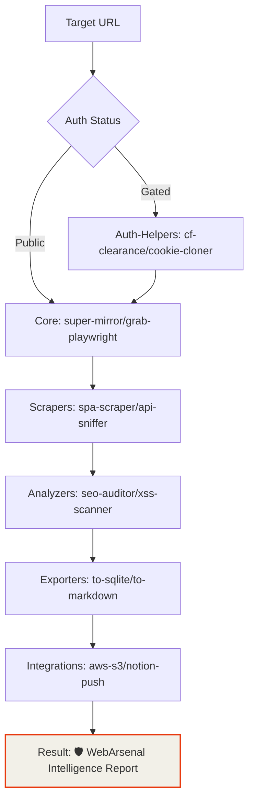
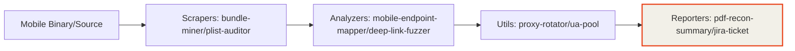

<div align="center">

<!-- BANNER -->


<br>

# 🛡️ WebArsenal v4.0.0
**The Ultimate High-Power Security Research & Automation Arsenal**
*Created by: de{c0}de by edwin dev*

WebArsenal is a Node.js toolkit for web mirroring, scraping, auditing, exporting, integrations, and monitoring.

- `v4.0.0`
- `320+` high-performance security modules
- **Creator**: de{c0}de by edwin dev
- **Dashboard**: [Interactive Vault](./index.html)

---

## ⚡ Operational Workflows

### 🌍 Web Intelligence Pipeline


### 📱 Mobile Security Workflow


## Install

Requirements:

- Node.js `18+`
- npm `8+`

Install dependencies:

```bash
npm install
```

The install includes the browser and platform packages used by the toolkit:

- `puppeteer`
- `playwright`
- `axios`
- `sqlite3`
- `aws-sdk`
- `sharp`
- `node-cron`

## Project Layout

```text
webarsenal/
|-- core/
|-- scrapers/
|-- analyzers/
|-- auth-helpers/
|-- exporters/
|-- integrations/
|-- monitors/
|-- utils/
|-- lib/
|-- tools/
|-- test/
`-- MODULES.md
```

## Core Workflows

Heavy-duty mirroring lives in `core/`:

```bash
node core/super-mirror.js --help
node core/grab-playwright.js --help
node core/pro-mirror.js --help
```

## Shared Modules

The rest of the toolkit is generated from a catalog and routed through a shared runtime. That gives the repo a larger surface area without the placeholder-script problem that was in the earlier version.

Examples:

```bash
node scrapers/spa-scraper.js --url https://example.com
node analyzers/seo-auditor.js --url https://example.com --output output/seo.json
node exporters/to-csv.js --input output/seo.json --output output/seo.csv
node exporters/to-sqlite.js --input output/seo.json --output output/seo.sqlite
node monitors/change-detector.js --url https://example.com --state-file .webarsenal-state/change.json
node auth-helpers/totp-generator.js --secret my-shared-secret
node utils/url-normalizer.js --url "https://example.com?b=2&a=1#section"
```

Most shared modules support the same core options:

```text
--url <url>
--input <path>
--output <path>
--limit <n>
--timeout <ms>
--headers <json>
--execute
--help
```

`integrations/` defaults to dry-run mode. Add `--execute` only when you want it to perform an external action.

## Module Catalog

The full inventory lives in [`MODULES.md`](./MODULES.md).

## 🔒 The Arsenal (320+ Modules)

| Category | Count | Power | Functional Goal |
| :--- | :--- | :--- | :--- |
| **Analyzers** | 93 | ⚡⚡⚡⚡⚡ | Security Audits, XSS, SSRF, Cloud Misconfigs |
| **Scrapers** | 78 | ⚡⚡⚡⚡ | Targeted Data, SPA, E-commerce, API Sniffing |
| **Integrations** | 45 | ⚡⚡⚡ | S3, Airtable, Notion, Discord, Slack |
| **Monitors** | 35 | ⚡⚡⚡ | Change Detection, Price Tracking, Uptime |
| **Auth Helpers** | 35 | ⚡⚡⚡⚡⚡ | Bypassing CF, Cookie Management, JWT Brute |
| **Exporters** | 35 | ⚡⚡ | Transformation: SQL, CSV, Markdown, WARC |
| **Core** | 20 | ⚡⚡⚡⚡⚡ | Recursive Mirroring & Orchestration |
| **Utils** | 76 | ⚡⚡ | Infrastructure Proxying, UA-Pool, Link Normalization |

For a searchable index of every script, use the **[Command Vault Dashboard](./index.html)**.

## Development

Regenerate the shared wrapper files:

```bash
npm run generate:modules
```

Validate that every shared module loads correctly:

```bash
npm run validate:modules
```

Run the test suite:

```bash
npm test
```

Run the full local CI script:

```bash
npm run ci
```

## CI

GitHub Actions is configured in [`.github/workflows/ci.yml`](./.github/workflows/ci.yml). It validates the generated module surface and runs the Node test suite on pushes and pull requests.

## 📖 Master Command Index
For an exhaustive, module-by-module command list, modifier letters, and power levels, see the **[MASTER_COMMAND_INDEX.md](./MASTER_COMMAND_INDEX.md)**.

---
**WebArsenal v4.0.0** | Created by **de{c0}de by edwin dev** | [MIT License](./LICENSE)
