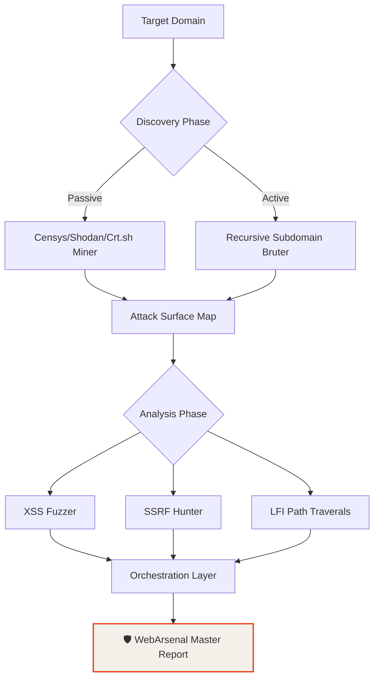
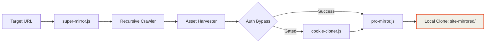

<div align="center">

<!-- BANNER -->


<br>

# 🛡️ WebArsenal v5.0.0
**The Ultimate High-Power Security Research & Automation Arsenal**
*Architected by: de{c0}de by edwin dev*

WebArsenal is an enterprise-grade, modular Node.js toolkit designed for horizontal and vertical reconnaissance, recursive site mirroring, and automated vulnerability exfiltration. Consolidating over **320+ specialized security scripts**, it provides a unified orchestration layer for the modern security researcher.

---

## ⚡ High-Power Strategic Workflows

### 🦅 Deep Reconnaissance Pipeline (Advanced)


### 📦 Exfiltration & Environment Mirroring


---

## 🔒 The Arsenal Inventory (320+ Modules)

| Category | Count | Power | Functional Goal | CLI Example |
| :--- | :--- | :--- | :--- | :--- |
| **Analyzers** | 93 | ⚡⚡⚡⚡⚡ | Security Audits, XSS, SSRF | `node analyzers/xss-fuzzer.js` |
| **Scrapers** | 78 | ⚡⚡⚡⚡ | Targeted Data, API Sniffing | `node scrapers/api-scraper.js` |
| **Integrations** | 45 | ⚡⚡⚡ | S3, Airtable, Notion | `node integrations/aws-s3-uploader.js` |
| **Monitors** | 35 | ⚡⚡⚡ | Change Detection, Uptime | `node monitors/change-detector.js` |
| **Auth Helpers** | 35 | ⚡⚡⚡⚡⚡ | Bypassing CF, JWT Brute | `node auth-helpers/cf-bypass.js` |
| **Exporters** | 35 | ⚡⚡ | SQL, CSV, Markdown, WARC | `node exporters/to-sqlite.js` |
| **Core** | 20 | ⚡⚡⚡⚡⚡ | Recursive Mirroring | `node core/super-mirror.js` |
| **Utils** | 76 | ⚡⚡ | Proxy-Rotator, UA-Pool | `node utils/proxy-rotator.js` |

---

## 🛠️ Operational Entrypoints

### 🚀 The Master Entrypoint
For full-spectrum orchestration across multiple modules, use the **Master Runner**:
```bash
node reporters/final-master-runner.js --target example.com --workflow recon-full
```

### 🧬 Core Command Suite
```bash
node core/super-mirror.js --url target.com --output ./mirrored
node analyzers/subdomain-takeover-v2.js --url target.com
```

---

## 💻 The Digital Commander (Interactive Vault)

WebArsenal features a built-in **Interactive Command Vault** (SPA) for building complex execution chains.

- **Real-Time Search**: Filter modules via `Ctrl+K`.
- **Live Intelligence Feed**: Monitor simulated reconnaissance alerts in the sidebar.
- **Pipeline Builder**: Chain modules and exfiltrate the final CLI command.

[**Launch The Command Vault**](file:///c:/Users/hp/webarsenal-1/index.html)

---

## 📜 Development & CI

WebArsenal is built for scale and reliability:
- **Module Generator**: `npm run generate:modules`
- **Surface Validation**: `npm run validate:modules`
- **CI/CD**: Fully integrated GitHub Actions for autonomous testing.
<div align="center">

<br/>

```
██╗    ██╗███████╗██████╗      █████╗ ██████╗ ███████╗███████╗███╗   ██╗ █████╗ ██╗
██║    ██║██╔════╝██╔══██╗    ██╔══██╗██╔══██╗██╔════╝██╔════╝████╗  ██║██╔══██╗██║
██║ █╗ ██║█████╗  ██████╔╝    ███████║██████╔╝███████╗█████╗  ██╔██╗ ██║███████║██║
██║███╗██║██╔══╝  ██╔══██╗    ██╔══██║██╔══██╗╚════██║██╔══╝  ██║╚██╗██║██╔══██║██║
╚███╔███╔╝███████╗██████╔╝    ██║  ██║██║  ██║███████║███████╗██║ ╚████║██║  ██║███████╗
 ╚══╝╚══╝ ╚══════╝╚═════╝     ╚═╝  ╚═╝╚═╝  ╚═╝╚══════╝╚══════╝╚═╝  ╚═══╝╚═╝  ╚═╝╚══════╝
```

### **The Full-Stack Web Intelligence & Security Research Toolkit**
*320 battle-hardened modules · Extraction · Recon · Analysis · Bug Hunting · Cloud Integration*

<br/>

[](https://github.com/edwinnyandika/webarsenal-v2/releases)
[](MODULES.md)
[](LICENSE)
[](https://nodejs.org)
[](https://github.com/edwinnyandika/webarsenal-v2/stargazers)
[](https://github.com/edwinnyandika/webarsenal-v2/actions)

<br/>

[⚡ Quick Start](#-quick-start) · [🗺️ Modules](#-module-map) · [🔥 Scenarios](#-real-world-scenarios) · [🛡️ Bug Hunter Mode](#-bug-hunter-mode) · [📖 Full Docs](MODULES.md)

</div>

---

## 🧠 What is WebArsenal v2?

**WebArsenal v2** is the most complete Node.js toolkit for full-stack web intelligence. 320 focused modules covering every phase — from deep site mirroring and data extraction to security surface mapping and cloud integration.

Built for **developers** who need data at scale, **SEO engineers** running audits, **data engineers** building pipelines, and **security researchers** mapping attack surface on authorized targets.

```
"The web is your database. WebArsenal is your query engine."
```

---

## ⚡ Quick Start

```bash
git clone https://github.com/edwinnyandika/webarsenal-v2.git
cd webarsenal-v2
npm install
node core/super-mirror.js --help
```

> ⚠️ Puppeteer/Playwright download browser binaries (~300MB) on first install.

---

## 🗺️ Module Map

```
webarsenal-v2/
├── 📁 core/            20 modules  · Heavy-duty site mirrors & downloaders
├── 📁 scrapers/        80 modules  · Targeted data extraction (SPAs, APIs, social)
├── 📁 analyzers/       80 modules  · DOM, SEO, JS, security surface analysis
├── 📁 auth-helpers/               · Auth bypass, cookie cloning, token tools
├── 📁 exporters/                  · Format conversion (SQLite, CSV, WARC, MD)
├── 📁 integrations/    60 modules  · Cloud push (S3, Notion, Airtable, Slack)
├── 📁 monitors/        40 modules  · Change detection, cron jobs, webhooks
├── 📁 utils/           40 modules  · Proxy rotation, rate limiting, UA spoofing
├── 📁 reporters/                  · Report generation
├── 📁 tools/                      · Security scanning helpers
├── 📁 lib/                        · Shared runtime & module catalog
└── 📁 test/                       · CI test suite
```

Full module inventory → [MODULES.md](MODULES.md)

---

## 🔥 Core Usage

### Site Mirroring

```bash
node core/super-mirror.js --url https://example.com --depth 4
node core/grab-playwright.js --url https://example.com --pdf
node core/pro-mirror.js --url https://example.com --depth 3 --screenshots
```

### Data Extraction

```bash
# SPA (React/Vue) — waits for JS hydration
node scrapers/spa-scraper.js --url https://app.example.com --wait-for '#root'

# E-commerce prices
node scrapers/ecommerce-scraper.js --url https://store.com --selector '.price'

# API endpoint sniffer — captures XHR/fetch traffic
node scrapers/api-sniffer.js --url https://example.com

# GraphQL schema extraction
node scrapers/graphql-scraper.js --url https://api.example.com/graphql
```

### Analysis

```bash
node analyzers/seo-auditor.js      --url https://example.com --output report.json
node analyzers/js-analyzer.js      --url https://example.com
node analyzers/security-headers.js --url https://example.com
node analyzers/cors-checker.js     --url https://api.example.com --origin https://evil.com
node analyzers/tech-detector.js    --url https://example.com
```

### Auth & Sessions

```bash
node auth-helpers/cf-clearance-puller.js --url https://cloudflare-site.com
node auth-helpers/cookie-cloner.js       --profile "C:\Chrome\Profile 1"
node auth-helpers/totp-generator.js      --secret MY_SHARED_SECRET
node auth-helpers/session-replay.js      --cookies session.json --url https://dashboard.example.com
```

### Export

```bash
node exporters/to-sqlite.js   --input data.json --output data.db
node exporters/to-csv.js      --input data.json --cols "title,price,url"
node exporters/to-warc.js     --dir ./mirrored  --output archive.warc
node exporters/to-markdown.js --input data.json
```

### Cloud Integration

```bash
# All integrations default to dry-run. Add --execute to go live.
node integrations/aws-s3-uploader.js  --dir ./site_data --bucket my-bucket --execute
node integrations/notion-sync.js      --input data.json --db NOTION_DB_ID --execute
node integrations/airtable-sync.js    --input records.json --token TOKEN --base BASE_ID --execute
node integrations/slack-alerter.js    --webhook HOOK_URL --message "Done ✓" --execute
```

### Monitoring

```bash
node monitors/change-detector.js  --url https://example.com --xpath "//div[@class='price']"
node monitors/screenshot-diff.js  --url https://example.com --threshold 5
node monitors/discord-webhook.js  --webhook DISCORD_URL --url https://example.com
node monitors/job-scheduler.js    --url https://example.com --cron "0 * * * *"
```

### Infrastructure Utils

```bash
node utils/proxy-rotator.js     --list proxies.txt --test
node utils/rate-limiter.js      --rps 2 --script scrapers/spa-scraper.js --url https://example.com
node utils/url-normalizer.js    --url "https://example.com?b=2&a=1#section"
node utils/ua-spoofing.js       --count 10
```

---

## 🔥 Real-World Scenarios

### Mirror a Cloudflare-Protected Site → S3

```bash
node auth-helpers/cf-clearance-puller.js --url https://store.com
node core/super-mirror.js --url https://store.com --depth 3 --cookie-jar cf_cookies.json
node integrations/aws-s3-uploader.js --dir ./super-mirrored-site --bucket backups --execute
node integrations/slack-alerter.js --webhook HOOK --message "Mirror complete ✓" --execute
```

### SPA Price Monitor → Discord

```bash
node scrapers/spa-scraper.js --url https://shop.example.com --wait-for '.product-list'
node exporters/to-sqlite.js --input prices.json --output prices.db
node monitors/change-detector.js --url https://shop.example.com --xpath "//span[@class='price']"
node monitors/discord-webhook.js --webhook YOUR_DISCORD_HOOK
```

### Full SEO Pipeline → Notion

```bash
node analyzers/seo-auditor.js --url https://mybusiness.com --output audit.json
node analyzers/unused-css.js --url https://mybusiness.com
node integrations/notion-sync.js --input audit.json --db YOUR_NOTION_DB --execute
```

---

## 🛡️ Bug Hunter Mode

> WebArsenal is used by security researchers on **authorized** bug bounty targets. The `analyzers/`, `auth-helpers/`, and `tools/` directories have dedicated modules for recon, surface mapping, and vulnerability detection.

**⚠️ AUTHORIZED USE ONLY. Only run security modules against systems you own or have explicit written permission to test. Valid contexts: HackerOne, Bugcrowd, Intigriti, YesWeHack, owned systems, private programs.**

### Security-Relevant Modules

```bash
# Detect exposed secrets and API keys in JS bundles
node analyzers/js-analyzer.js --url https://target.com

# Check for missing/misconfigured security headers
node analyzers/security-headers.js --url https://target.com

# CORS misconfiguration detector
node analyzers/cors-checker.js --url https://api.target.com --origin https://evil.com

# Technology stack fingerprinting
node analyzers/tech-detector.js --url https://target.com

# Enumerate API endpoints from JavaScript bundles
node scrapers/api-sniffer.js --url https://target.com

# Full endpoint crawl
node scrapers/endpoint-crawler.js --url https://target.com --depth 4 --output endpoints.json

# Subdomain asset mapper
node analyzers/subdomain-mapper.js --domain target.com
```

### Coming in v5: Full Bug Hunter Expansion

See [ABOUT.md](ABOUT.md) for the complete roadmap. Planned additions:

| New Directory | Modules |
|---|---|
| `security/recon/` | Passive subdomain enum, certificate transparency, OSINT collectors |
| `security/scanners/` | Header checks, CORS, open redirect, subdomain takeover, secrets |
| `security/fuzzing/` | Parameter discovery, directory bruteforce, endpoint fuzzing |
| `security/reporters/` | HackerOne/Bugcrowd report generator with CVSS scoring |
| `security/payloads/` | Curated safe detection payloads for all OWASP Top 10 classes |

---

## 🛠️ Development

```bash
npm run generate:modules   # Regenerate shared module wrappers
npm run validate:modules   # Validate every module loads correctly
npm test                   # Run test suite
npm run ci                 # Full local CI
```

CI runs on every push → [`.github/workflows/ci.yml`](.github/workflows/ci.yml)

---

## 📦 Dependencies

`puppeteer` · `playwright` · `cheerio` · `axios` · `sqlite3` · `aws-sdk` · `node-cron` · `sharp`

---

## ⚖️ Legal & Ethics

- ✅ Own or have **explicit written permission** to test every target
- ✅ Respect `robots.txt` and server rate limits
- ✅ Follow responsible disclosure for any security findings
- ❌ No unauthorized access, data theft, or abuse
- ❌ No circumvention of legal protections

---

## 📄 License

MIT © [Edwin Nyandika](https://github.com/edwinnyandika) — see [LICENSE](LICENSE)

---

<div align="center">

**Built by de{c0}de by Edwin Dev**

[⭐ Star this repo](https://github.com/edwinnyandika/webarsenal-v2) · [🐛 Issues](https://github.com/edwinnyandika/webarsenal-v2/issues) · [🌐 Live Site](https://webarsenal-v2.vercel.app)

*A ⭐ helps more developers and security researchers find this toolkit.*

</div>
