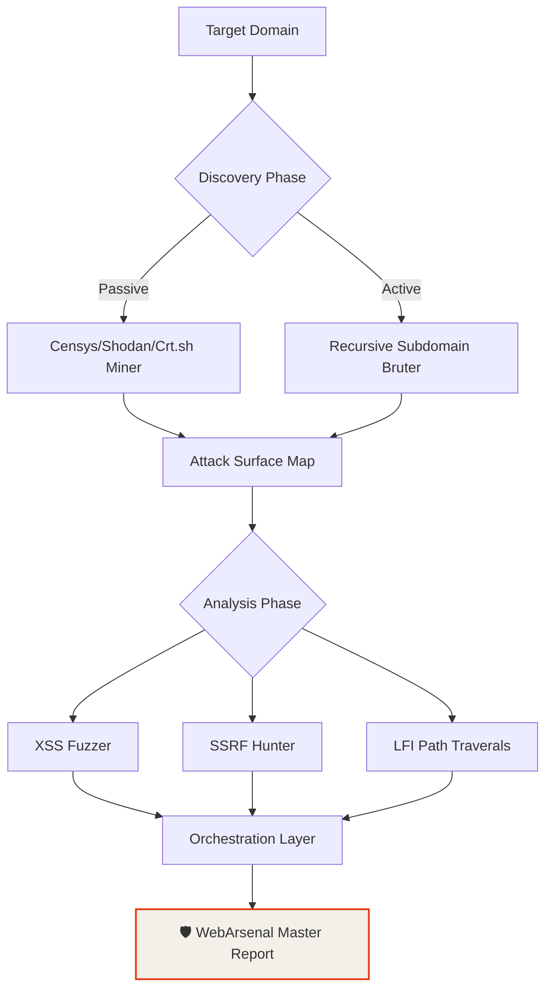
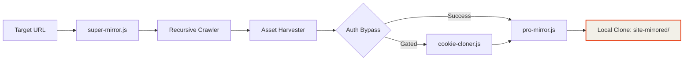

<div align="center">

<!-- BANNER -->


<br>

# 🛡️ WebArsenal v5.0.0
**The Ultimate High-Power Security Research & Automation Arsenal**
*Architected by: de{c0}de by edwin dev*

WebArsenal is an enterprise-grade, modular Node.js toolkit designed for horizontal and vertical reconnaissance, recursive site mirroring, and automated vulnerability exfiltration. Consolidating over **320+ specialized security scripts**, it provides a unified orchestration layer for the modern security researcher.

---

## ⚡ High-Power Strategic Workflows

### 🦅 Deep Reconnaissance Pipeline (Advanced)


### 📦 Exfiltration & Environment Mirroring


---

## 🔒 The Arsenal Inventory (320+ Modules)

| Category | Count | Power | Functional Goal | CLI Example |
| :--- | :--- | :--- | :--- | :--- |
| **Analyzers** | 93 | ⚡⚡⚡⚡⚡ | Security Audits, XSS, SSRF | `node analyzers/xss-fuzzer.js` |
| **Scrapers** | 78 | ⚡⚡⚡⚡ | Targeted Data, API Sniffing | `node scrapers/api-scraper.js` |
| **Integrations** | 45 | ⚡⚡⚡ | S3, Airtable, Notion | `node integrations/aws-s3-uploader.js` |
| **Monitors** | 35 | ⚡⚡⚡ | Change Detection, Uptime | `node monitors/change-detector.js` |
| **Auth Helpers** | 35 | ⚡⚡⚡⚡⚡ | Bypassing CF, JWT Brute | `node auth-helpers/cf-bypass.js` |
| **Exporters** | 35 | ⚡⚡ | SQL, CSV, Markdown, WARC | `node exporters/to-sqlite.js` |
| **Core** | 20 | ⚡⚡⚡⚡⚡ | Recursive Mirroring | `node core/super-mirror.js` |
| **Utils** | 76 | ⚡⚡ | Proxy-Rotator, UA-Pool | `node utils/proxy-rotator.js` |

---

## 🛠️ Operational Entrypoints

### 🚀 The Master Entrypoint
For full-spectrum orchestration across multiple modules, use the **Master Runner**:
```bash
node reporters/final-master-runner.js --target example.com --workflow recon-full
```

### 🧬 Core Command Suite
```bash
node core/super-mirror.js --url target.com --output ./mirrored
node analyzers/subdomain-takeover-v2.js --url target.com
```

---

## 💻 The Digital Commander (Interactive Vault)

WebArsenal features a built-in **Interactive Command Vault** (SPA) for building complex execution chains.

- **Real-Time Search**: Filter modules via `Ctrl+K`.
- **Live Intelligence Feed**: Monitor simulated reconnaissance alerts in the sidebar.
- **Pipeline Builder**: Chain modules and exfiltrate the final CLI command.

[**Launch The Command Vault**](file:///c:/Users/hp/webarsenal-1/index.html)

---

## 📜 Development & CI

WebArsenal is built for scale and reliability:
- **Module Generator**: `npm run generate:modules`
- **Surface Validation**: `npm run validate:modules`
- **CI/CD**: Fully integrated GitHub Actions for autonomous testing.

---
**WebArsenal v5.0.0** | Created by **de{c0}de by edwin dev** | [MIT License](./LICENSE)
